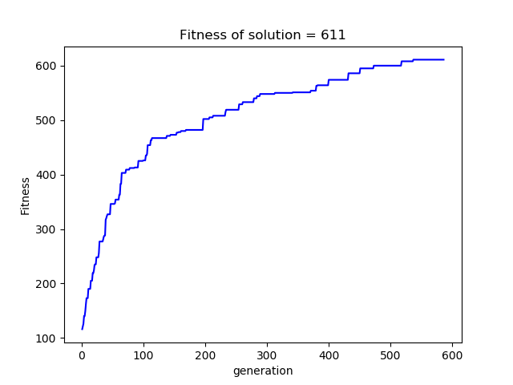

# Team Game Optimization using Genetic Algorithm

Using genetic algorithm to solve a variant of team game optimization problem in python language.


## Problem Description:

Given N tasks each having some points and M team members, time matrix, skills required for each task, skills possessed by each member, and total time limit T for each member, find the assignment of tasks to members such that points scored are maximized. 

### 1. Data Format

> N -> number of tasks. <br>
> M -> number of team members. <br>
> T -> time limit for each member. <br>
> K -> number of skills. <br>
> P -> a N length array where ith position indicates points for task i. <br>
> t -> A NxM Time matrix where, 
> t(i,j) = time taken by member j to complete task i. <br>
> S_t -> a NxK matrix where, S_t(i,j)= 1, if ith task requires skill j else 0. <br>
> S_m -> a MxK matrix where, S_m(i,j)= 1, if ith member possesses skill j else 0.

### 2. Constraints

Various constraints are as follows:

1. Each task can be assigned to exactly one team member.

2. The total time of tasks assigned to a team member should be less than time limit T. <br> <br> 


3. Task i can only be assigned to member j if for each x in 1 to K, if S_t(I,x) = 1, then S_m(j,x) should also be = 1. 

### 3. Fitness 

In out problem, the fitness function is the total points scored from the assignment. We further check every chromosome for the constraints and if it is invalid, we mark the fitness as 0. <br> <br>


### 4. Genetic Operators

1. *Selection* <br>
We use tournament selection in our problem.

2. *Crossover* <br>
We use multi point crossover where alternating segments are swapped to get new off-springs. <br> <br>


3. *Mutation* <br>
We use random resetting where each gene in a chromosome is given a chance to mutate to a random value from 0 to M. <br> <br>


<br>

## Instructions to run:

The project consists of two stages:

1. Generation of input data
2. Using GA to find optimized solution


### Step 1: Generate input data

a) Modify the following parameters in generator.py

> n_tasks (N) - number of tasks<br>
> n_members (M) - number of members <br>
> n_skills (K) - number of skills <br>
> time_limit (T) - total time limit <br>
> max_time_task - max time of a generated task <br>

b) Modify ga paramaters in generator.py

> population_size <br>
>  elitism_size <br>
>  generations <br>
>  crossover_probability <br>
>  mutation_probability

Execute by:
```
python generator.py
```

The script will generate data in output/data.json


### Step 2: Apply Genetic Algorithm

Execute by:
```
python ga.py
```

## Output:

Example output 1:


<br>
Example output 2:


